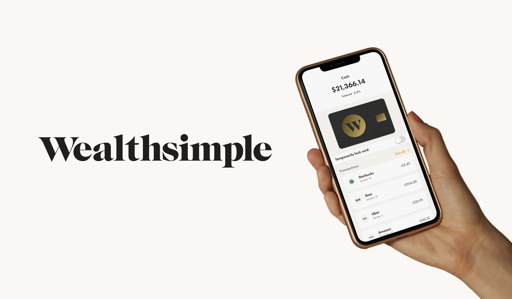

# WealthSimple Case Study

## Overview and Origin
---
As digital finance becomes increasingly popular in modern society, people have developed new ways to leverage technology with respect to their personal finances. Wealthsimple is a company that exemplifies this phenomenon by creating an online platform where members of society can have the freedom to invest and manage their hard-earned money.
    
Wealthsimple is an online broker based in Toronto, Canada. It was incorporated in September 2014 by the current CEO Michael Katchen. The concept behind Wealthsimple was sparked by two events. The first event was after Katchen's old business partners had approached him for advice following the sale of their old startup company. The second event was at the age of twelve, when Katchen had entered a stock-picking contest and built a portfolio of ETFs in Microsoft Excel that could be balanced and managed in such a way that would reduce trading fees. This simple model created his first small customer base, and later evolved into Wealthsimple as it is today.

Wealthsimple makes money by charging currency exchange fees when users deposit funds to trade with, payment processing fees when Wealthsimple Cash users spend with their card, and fees charged for access to their robo-managed ETFs.

The company is funded by charging currency exchange fees, payment processing fees when consumers spend with their card, and fees charged to use their automated ETF service. Over it's history, Welathsimple has raised a total of $900.4 million.

## Business Activities
---
As of recently, the main challenge Wealthsimple faces is expanding to other countries. This is portrayed in their recent retraction from the United Kingdom in December 2021. The reason why this decision was made was so Wealthsimple could put more of a focus on their client base in Canada.

Wealthsimple's [mission statement](https://www.wealthsimple.com/en-ca/careers#:~:text=Our%20mission%20is%20to%20help,affordable%20financial%20products%20for%20everyone) is as follows:

*"Our mission is to help everyone achieve financial freedom, no matter who they are or how much they have. We’re reimagining what it means to manage your money by making simple, smart and affordable financial products for everyone."*

Given the mission statement taken directly from their website, it is evident that the audience this company caters to are common members of society, regardless of income or status. They are able to serve a broad audience of consumers as they offer financial products that are suitable to each consumer's specific financial needs and goals. Another way that they are able to reach such a broad audience is because of their simplistic approach to explain how financial products work. This is evident in how simple it is to use their platform and supplementary tools, such as their online retirement calculator. It is an effective method to cater to an audience that is less financially versed while offering suitable products that fit their needs.

One of Wealthsimple's main selling points is that they offer comission-free trades on specific stocks and exhange traded funds (ETFs). This specific point makes Wealthsimple stand out as an online broker because most other trading platforms and investment firms charge a commission for trading assets. Another key business metric that stands out is their fractional stock and ETF offering. This allows customers the ability to purchase a fraction of a stock or ETF if they do not posess enough funds to purchase an entire unit. This idea is yet to be implemented by many of Wealthsimple's competitors.

According to StackShare, Wealthsimple is currently using 61 technologies, some of which include Java, Google Drive, GitHub, and Slack.

## Landscape
---
Wealthsimple's domain in the FinTech industry lies in robo-advising and personal finance. Over the past five to ten years, this domain has evolved rapidly along with developments in technology. A specific example involved the evolving process of this domain can be captured within the more recent populariazation of cryptocurrencies. Originally, online brokers would only offer specific asset classes and commodities to be traded on their platforms, such as stocks, ETFs, bonds, oil, and gold. However, as cryptocurrencies are becoming increasingly popular, more of these online brokers are looking to find a way to allow their consumer base to tap into the cryptocurrency market through their platforms. Hence, the rise of cryptocurrencies not only offer societal growth in terms of how monetary policy could change in the future, but it also provides these online brokers an opportunity to tap into a new market. The concept of cryptocurrencies involved with trading platforms can be captured in the history of Wealthsimple. Wealthsimple added the option of trading cryptocurrencies as recent as August 2020. Since then, its customer base has the ability to trade over fifty different coins; and the list is continuing to expand.

By name, some of Wealthsimple's largest competitors include Questrade, Interactive Brokers, TD Direct Investing, and CIBC Investor's Edge.

## Results
---
Wealthsimple has grown to be one of the most popular online brokers in Canada since its conception eight years ago. Just as of last year, Wealthsimple had $9.7 billion in assets under management and has over 1.5 billion customers using their platform. More recent data says that as of spring 2022, assets under management has increased to $15 billion. From these metrics, one can derive that Wealthsimple's assets under management has increased by about 54% in the span of one year. This shows that Wealthsimple is growing quickly in the Canadian market and there is a possibility of it returning to international markets in the near future. Wealthsimple seems to be growing on par with its competitors.

## Recommendations
---
Wealthsimple has a good understanding of the needs of its customers. This is evident in their most recent business decisions as outlined previously. My recommendation would build on their business decision to allow their consumers to invest in cryptocurrency. At this time, the Wealthsimple platform allows its consumers the opportunity to invest in a cryptocurrency of their choice, but not directly own the asset. As a result, users are unable to withdraw the currency that they invested in on the platform. Although this structure makes sense for its consumer base, I believe Wealthsimple is presented an opportunity to further expand its reach to consumers.

I recommend that Wealthsimple comes up with a way to give their consumers the option of directly owning a cryptocurrency. This business decision would be mainly focused on the consumers who are more familiar with how to manage their own cryptocurrencies. This way, consumers have the option of storing their investments in cold wallets thus optimizing security. Providing this option would also benefit Wealthsimple as it hedges the risk of loss in case of theft from their online platform.

## Bibliography
---
1. Wealthsimple. (n.d.). Who We Are. Retrieved November 18, 2022, from https://www.wealthsimple.com/en-ca/about
2. Brown, J. R. (2022, November 17). Wealthsimple Trade Review. Investopedia. Retrieved November 19, 2022, from https://www.investopedia.com/wealthsimple-trade-review-6503907 
3. Wealthsimple. (n.d.). Wealthsimple: Investing, Regulated Crypto, Stocks &amp; ETFs. Wealthsimple. Retrieved November 19, 2022, from https://www.wealthsimple.com/en-ca/careers#:~:text=Our%20mission%20is%20to%20help,affordable%20financial%20products%20for%20everyone
4. Startup Here Toronto. (n.d.). Wealthsimple: Growing with Toronto’s Supportive Tech Ecosystem. Startup Here Toronto. Retrieved November 19, 2022, from https://startupheretoronto.com/success-story/wealthsimple/
5. Sheth, N. (2022, August 18). How does Wealthsimple make money? Finty. Retrieved November 19, 2022, from https://finty.com/ca/business-models/wealthsimple/#:~:text=card%20for%20spending.-,How%20Wealthsimple%20makes%20money,to%20their%20robo%2Dmanaged%20ETFs. 
6. Crunchbase. (n.d.). Wealthsimple. Crunchbase. Retrieved November 19, 2022, from https://www.crunchbase.com/organization/wealthsimple/technology
7. Stackshare. (n.d.). Wealthsimple. Stackshare. Retrieved November 19, 2022, from https://stackshare.io/wealthsimple/wealthsimple
8. Saminather, N. (2022, January 31). Canada's Wealthsimple aims for real-world cryptocurrency use as it looks beyond trading. Reuters. Retrieved November 19, 2022, from https://www.reuters.com/technology/canadas-wealthsimple-aims-real-world-cryptocurrency-use-it-looks-beyond-trading-2022-01-31/#:~:text=Launched%20in%202014%20as%20a,it%20intends%20to%20enable%20withdrawals. 
9. Wealthsimple. (n.d.). Wealthsimple. Wealthsimple: The simple way to buy and sell crypto in Canada. Retrieved November 19, 2022, from https://www.wealthsimple.com/en-ca/invest/crypto
10. Reinkensmeyer, B. (2022, October 11). 5 Best Online Brokers Canada for 2022. Stockbrokers.com. Retrieved November 19, 2022, from https://www.stockbrokers.com/guides/best-brokers-canada
11. Pelletier, M. (2021, May 7). Wealthsimple valuation should be a wake-up call for big banks and traditional money managers. Financial Post. Retrieved November 20, 2022, from https://financialpost.com/investing/wealthsimple-valuation-should-be-a-wake-up-call-for-big-banks-and-traditional-money-managers
12. White, M., & Satov, T. (2022, July 21). Wealthsimple Trade in-depth review 2022: The pros and cons. MoneySense. Retrieved November 20, 2022, from https://www.moneysense.ca/save/investing/wealthsimple-trade-review/
13. Francis, K. (2020, November 26). Do You Own Your Cryptocurrency on WealthSimple and PayPal? CryptoVantage. Retrieved November 20, 2022, from https://www.cryptovantage.com/news/do-you-own-your-cryptocurrency-on-wealthsimple-and-paypal/#:~:text=The%20second%20is%20that%20WealthSimple,not%20own%20the%20asset%20directly

